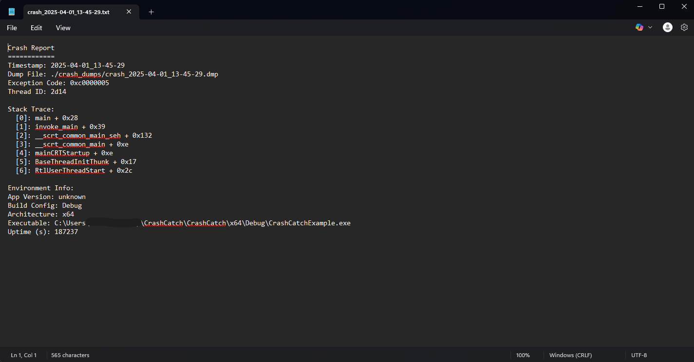
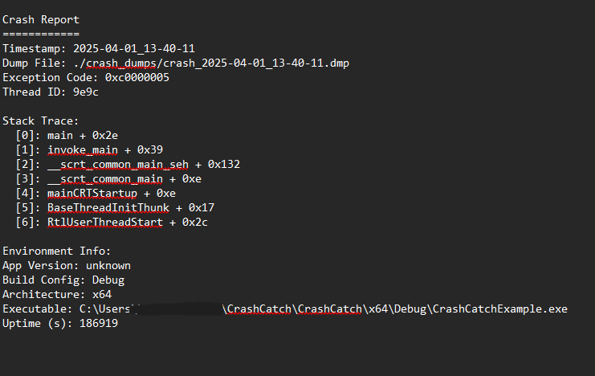
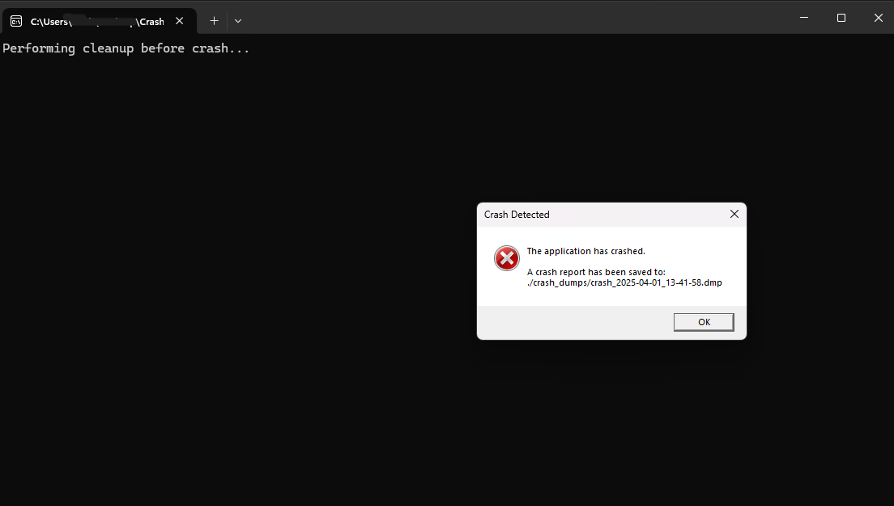
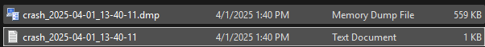

# CrashCatch

💥 _A modern, single-header crash reporting library for C++ on Windows and Linux._


[](https://github.com/keithpotz/CrashCatch/stargazers)

---

## 🚀 What is CrashCatch?

CrashCatch is a modern, single-header crash reporting library for C++ applications — supporting both **Windows** and **Linux**.

It automatically captures crashes, logs diagnostic information, generates `.dmp` (Windows) or `.txt` (Windows & Linux) reports, and includes accurate stack traces and environment metadata. From minimal CLI tools to full desktop apps, CrashCatch fits right in.

Key highlights:
- No external dependencies just include the header
- Accurate crash-site stack traces Windows stack walk uses the actual crash context, not the handler frame
- Full crash context (timestamp, platform, executable path, version, etc.)
- Callbacks fire **after** crash files are written safe to read or upload from within `onCrash`
- Async-signal-safe Linux handler via `fork()` no deadlocks even on heap corruption
- Configurable `onCrash()` and `onCrashUpload()` hooks
- Optional crash dialog support (Windows GUI apps)
- Available via **vcpkg** and **Conan**

> **v1.4.0** — Correctness release: accurate crash-site stack context, async-signal-safe Linux handler, callbacks after file write, thread-safe timestamps, and more.

> **v1.3.0** — Windows stack trace output in `.txt` logs, `includeStackTrace` config flag, and DLL/shared library support via `CrashCatchDLL.hpp`.

> **v1.2.0** — Complete Linux support with signal handling, demangled stack traces, and crash context generation.

---

## 🤔 Why CrashCatch?

Most crash reporting solutions for C++ require heavyweight SDKs, mandatory cloud uploads, or days of wiring up Crashpad just to get a stack trace. CrashCatch is different:

| | CrashCatch | Crashpad | Sentry Native | Backtrace |
|---|---|---|---|---|
| Single header | ✅ | ❌ | ❌ | ❌ |
| No external dependencies | ✅ | ❌ | ❌ | ❌ |
| Offline-first | ✅ | ❌ | ❌ | ❌ |
| Windows + Linux | ✅ | ✅ | ✅ | ✅ |
| onCrash / onUpload hooks | ✅ | ❌ | ✅ | ✅ |
| Free & open source | ✅ | ✅ | Partial | ❌ |

---

## ✅ Supported Platforms

| OS      | Supported | Crash Handling Method   |
|---------|-----------|--------------------------|
| Windows | ✅ Yes    | `SetUnhandledExceptionFilter` + MiniDump + StackWalk64 |
| Linux   | ✅ Yes    | POSIX signals + `backtrace()` + `fork()` for safe I/O |
| macOS   | 🚧 Planned | POSIX + Mach exceptions |

---

## ⚡ Quick Start

### Zero Config (Auto-init)
```cpp
#define CRASHCATCH_AUTO_INIT
#include "CrashCatch.hpp"

int main() {
    int* ptr = nullptr;
    *ptr = 42; // CrashCatch catches this automatically
}
```

### One-Liner Setup
```cpp
#include "CrashCatch.hpp"

int main() {
    CrashCatch::enable();
    int* ptr = nullptr;
    *ptr = 42;
}
```

### Full Config Example
```cpp
#include "CrashCatch.hpp"
#include <iostream>

int main() {
    CrashCatch::Config config;
    config.appVersion      = "2.0.0";
    config.buildConfig     = "Release";
    config.additionalNotes = "Test build";
    config.showCrashDialog = false;

    config.onCrash = [](const CrashCatch::CrashContext& ctx) {
        // Files are on disk — safe to read or upload here
        std::cout << "Crash log: " << ctx.logFilePath << "\n";
    };

    CrashCatch::initialize(config);

    int* ptr = nullptr;
    *ptr = 42;
}
```

---

## 📦 Installing

### Header only
Copy `CrashCatch.hpp` into your project no build system required.

### CMake
```bash
mkdir build && cd build
cmake .. -DCMAKE_INSTALL_PREFIX=./install
cmake --build . --target install
```
```cmake
find_package(CrashCatch REQUIRED)
target_link_libraries(MyApp PRIVATE CrashCatch::CrashCatch)
```

### vcpkg
```bash
vcpkg install crashcatch
```

### Conan
```bash
conan install crashcatch/1.4.0
```

---

## 🧪 Examples

Explore working examples in the GitHub repo:

| Example | What it demonstrates |
|---|---|
| `Example_ZeroConfig` | Auto-init with `CRASHCATCH_AUTO_INIT` macro |
| `Example_OneLiner` | `CrashCatch::enable()` minimal setup |
| `Example_FullConfig` | All config options including callbacks |
| `Example_ThreadCrash` | Crash on a non-main thread |
| `Example_divideByZero` | Arithmetic exception handling |
| `Example_UploadCrash` | `onCrashUpload` reading and uploading files |
| `Example_StackTrace` | `includeStackTrace` flag |

[View Examples Folder](../examples/)

---

## 📸 Screenshots






---

## 🛠 Features

- ✅ **Header-only** single `.hpp`, no external dependencies
- ✅ **Cross-platform** Windows & Linux support out of the box
- ✅ **Accurate crash-site stack traces** Windows stack walk uses `ep->ContextRecord`, not the handler frame *(v1.4.0)*
- ✅ **Async-signal-safe Linux handler** uses `fork()` so heap corruption can't deadlock the handler *(v1.4.0)*
- ✅ **Callbacks fire after files are written** safe to read or upload from `onCrash` / `onCrashUpload` *(v1.4.0)*
- ✅ **Thread-safe timestamps** `localtime_s` / `localtime_r` *(v1.4.0)*
- ✅ **Automatic Crash Capture** via `SetUnhandledExceptionFilter` (Windows) or POSIX signals (Linux)
- ✅ **Crash Context Info** includes executable path, build config, version, and notes
- ✅ **Crash Reporting** `.dmp` (Windows) and `.txt` (Windows & Linux) crash files
- ✅ **Symbol Resolution** `SymFromAddr` + file/line info (Windows), demangled symbols (Linux)
- ✅ **`onCrash` Callback** run custom cleanup or logging with full crash context
- ✅ **`onCrashUpload` Hook** pass report data to your custom uploader
- ✅ **`includeStackTrace` flag** suppress stack trace output when not needed *(v1.3.0)*
- ✅ **DLL / shared library support** plain C interface via `CrashCatchDLL.hpp` for C++11/C++98 consumers *(v1.3.0)*
- ✅ **Optional Crash Dialog** user-friendly message box (Windows only)
- ✅ **Configurable** dump location, filename prefix, timestamping, and more
- ✅ **CMake + vcpkg + Conan** multiple install paths supported

---

## 📋 Requirements

- C++17 or later (or C++11/C++98/C via `CrashCatchDLL.hpp`)
- **Windows**: MSVC (Visual Studio 2019+) or MinGW
- **Linux**: GCC or Clang with `-rdynamic` for stack traces

---

## 🗺 Roadmap

- [x] Windows crash capture + MiniDump
- [x] Linux signal handling + backtrace
- [x] `onCrash` and `onCrashUpload` hooks
- [x] CMake install support
- [x] DLL / shared library support (`CrashCatchDLL.hpp`)
- [x] Windows stack trace in `.txt` log + `includeStackTrace` flag
- [x] Accurate crash-site stack context
- [x] Async-signal-safe Linux crash handler
- [x] Thread-safe timestamps
- [x] vcpkg and Conan package registry support
- [ ] macOS support (POSIX + Mach exceptions)

---

## 🔬 Understand Your Crashes CrashCatch Analyzer

CrashCatch generates the report. **[CrashCatch Analyzer](https://github.com/keithpotz/Crash-Catch-Analyzer-Release)** tells you what it means.

Drop in a crash report and get:

- Symbolicated stack traces
- Plain-English root cause explanation *(Explain Mode)*
- Deep technical analysis for engineers *(Engineer Mode)*
- PDF export for sharing with your team

> Currently in Beta. **[Download on GitHub](https://github.com/keithpotz/Crash-Catch-Analyzer-Release)**

---

## 📄 License

MIT License — created and maintained by **Keith Pottratz**
[GitHub Repo](https://github.com/keithpotz/CrashCatch)
