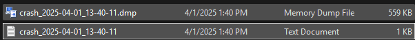

# CrashCatch

💥 _A modern, single-header crash reporting library for C++ on Windows and Linux._


---
---

## 🚀 What is CrashCatch?

CrashCatch is a modern, single-header crash reporting library for C++ applications — supporting both **Windows** and **Linux**.

It automatically captures crashes, logs diagnostic information, generates `.dmp` (Windows) or `.txt` (Windows & Linux) reports, and includes stack traces and environment metadata. From minimal CLI tools to full desktop apps, CrashCatch fits right in.

Key highlights:
- No external dependencies — just include the header
- Full crash context (timestamp, platform, executable path, version, etc.)
- Symbol resolution and demangling (platform-specific)
- Configurable `onCrash()` and `onCrashUpload()` hooks
- Optional crash dialog support (Windows GUI apps)

> As of **v1.2.0**, CrashCatch offers complete Linux support with signal handling, demangled stack traces, and crash context generation.

---


## ✅ Supported Platforms

| OS      | Supported | Crash Handling Method   |
|---------|-----------|--------------------------|
| Windows | ✅ Yes    | `SetUnhandledExceptionFilter` + MiniDump |
| Linux   | ✅ Yes    | POSIX signals (`signal()`) + backtrace |
| macOS   | 🚧 Planned | POSIX + Mach exceptions

---


## ⚡ Quick Start

### Zero Config (Auto-init)
```cpp
#define CRASHCATCH_AUTO_INIT
#include "CrashCatch.hpp"

int main() {
    int* ptr = nullptr;
    *ptr = 42; // simulated crash
}
```

### One-Liner Setup
```cpp
#include "CrashCatch.hpp"

int main() {
    CrashCatch::enable();
    int* ptr = nullptr;
    *ptr = 42;
}
```

### Full Config Example
```cpp
#include "CrashCatch.hpp"

int main() {
    CrashCatch::Config config;
    config.appVersion = "1.1.0";
    config.buildConfig = "Release";
    config.additionalNotes = "Test build";
    config.showCrashDialog = true;
    config.onCrash = [] {
        std::cout << "Cleaning up before crash...\n";
    };

    CrashCatch::initialize(config);

    int* ptr = nullptr;
    *ptr = 42;
}
```

---

## 📦 Installing with CMake

```bash
mkdir build && cd build
cmake .. -DCMAKE_INSTALL_PREFIX=./install
cmake --build . --target install
```

Then in another project:

```cmake
find_package(CrashCatch REQUIRED)
target_link_libraries(MyApp PRIVATE CrashCatch::CrashCatch)
```

---

## 🧪 Examples
Explore working examples in the GitHub repo:
- ZeroConfig
- OneLiner
- FullConfig
- ThreadCrash
- DivideByZero

[View Examples Folder](../examples/)

---

## 📸 Screenshots




---

## 🛠 Features

- ✅ **Header-only** — single `.hpp`, no external dependencies
- ✅ **Cross-platform** — Windows & Linux support out of the box
- ✅ **Automatic Crash Capture** — via `SetUnhandledExceptionFilter` (Windows) or POSIX signals (Linux)
- ✅ **Crash Context Info** — includes executable path, build config, version, and notes
- ✅ **Crash Reporting**:
  - `.dmp` (Windows) or `.txt` (Linux/Windows) crash files
  - Detailed stack traces and environment info
- ✅ **Symbol Resolution**:
  - Top frame symbols (Windows)
  - Demangled symbols (Linux)
- ✅ **onCrash Callback** — run custom cleanup or logging logic with full crash context
- ✅ **Optional Crash Dialog** — user-friendly message box (Windows only)
- ✅ **Configurable Dump Location**, filename prefix, and timestamping
- ✅ **onCrashUpload Hook** — pass report data to your custom uploader
- ✅ **CMake + CI Friendly** — drop-in installation and build support

---

## 📄 License
MIT License — created and maintained by **Keith Pottratz**  
[GitHub Repo](https://github.com/keithpotz/CrashCatch)


Created by **Keith Pottratz**  
MIT Licensed
