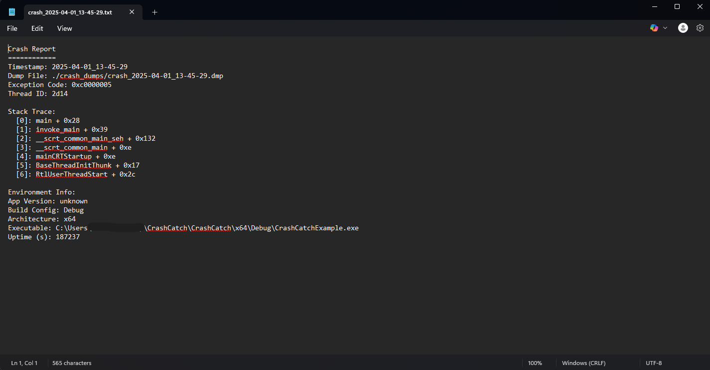
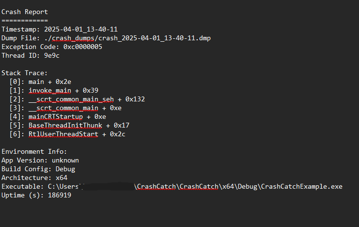
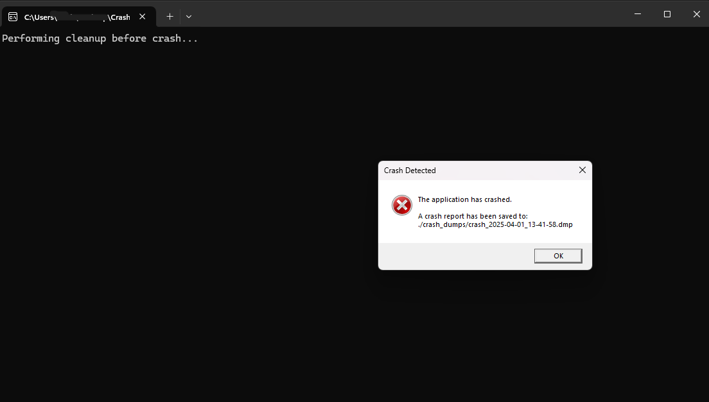

# 📸 Screenshots

Below are example screenshots of CrashCatch in action.

---

### 🟢 Zero Config Example
Auto-init mode with no setup required.

---

### 🟡 One-Liner Setup
Simple usage with `CrashCatch::enable()`.

---

### ⚙️ Full Configuration
Custom version tags, cleanup callbacks, and message box enabled.

---

### 📋 Crash Dialog
Optional message box shown after crash.

---

Make sure crash logging is enabled and check the `./crash_dumps/` directory for output.