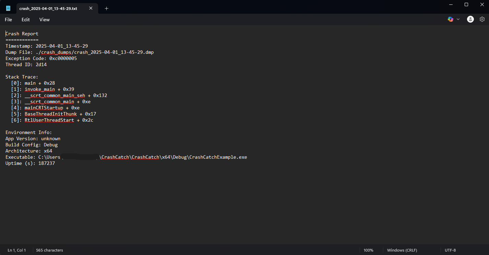
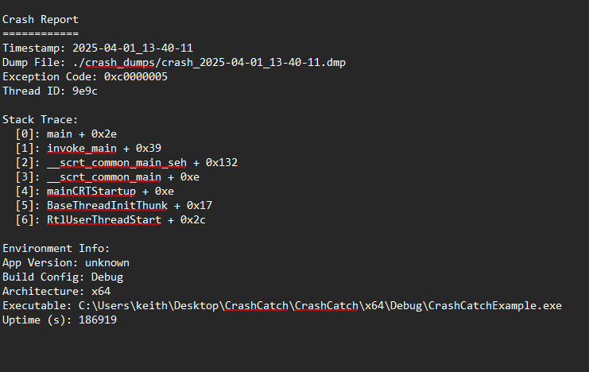
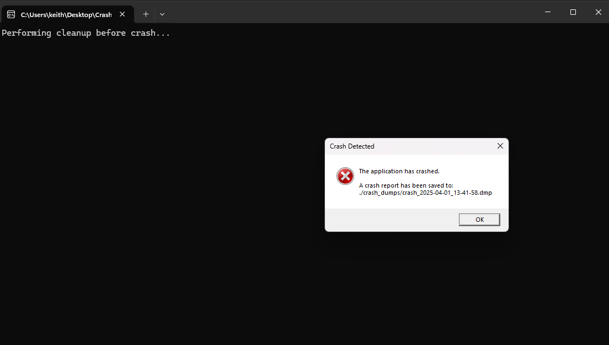
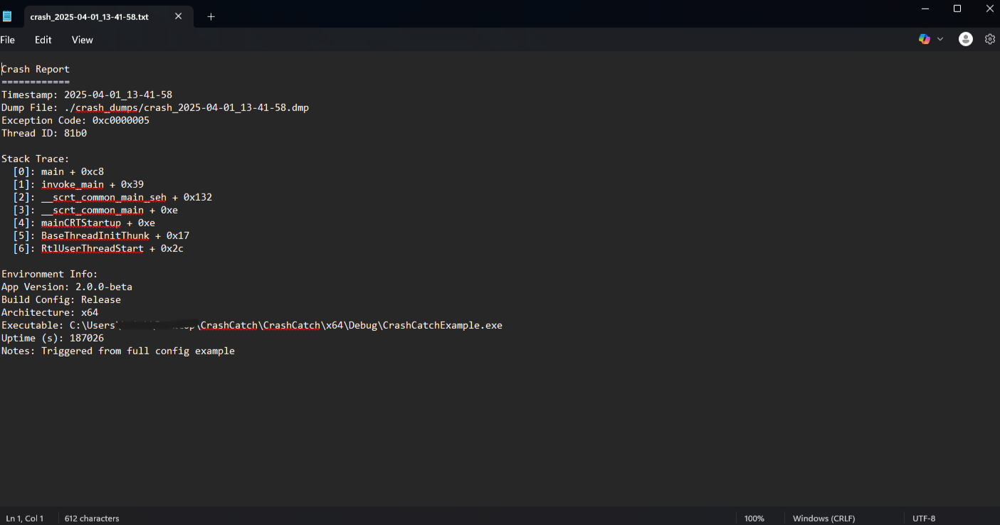
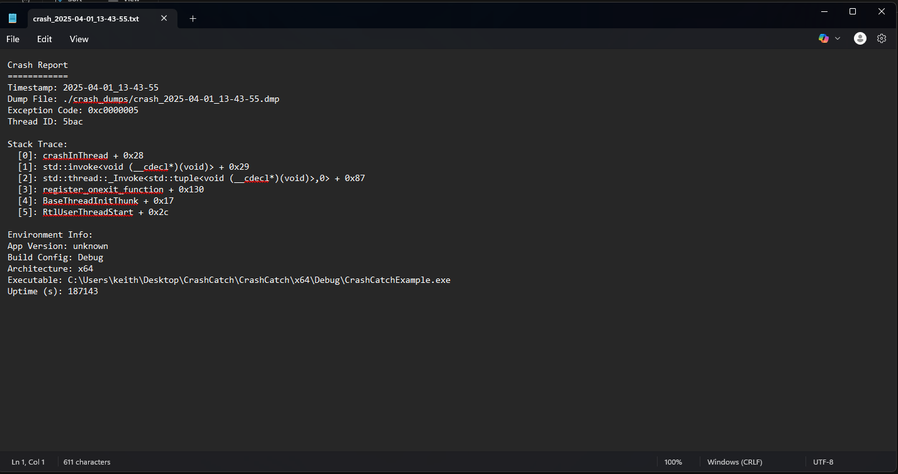
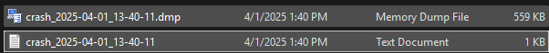

# 🚀 CrashCatch Examples

This folder contains real-world examples of how to use CrashCatch.

| File                      | Description                                |
|---------------------------|--------------------------------------------|
| `Example_ZeroConfig.cpp`  | Zero-config setup using auto-init macro    |
| `Example_OneLiner.cpp`    | Initializes with a single function call    |
| `Example_FullConfig.cpp`  | Full customization with callback + dialog  |
| `Example_ThreadCrash.cpp` | Crash simulation in a background thread    |
| `Example_DivideByZero.cpp`| Simulates arithmetic crash                 |

To run:  
Build any file in Visual Studio, g++, or another C++ IDE.
---
## 📸 Example Outputs

### 🟢 Zero Config Mode

### 🟡 One-Liner Init

### 🔧 Full Config - Console Output

### 🔧 Full Config - Crash Log

### 🧵 Thread Crash Example

### Basic File Names

